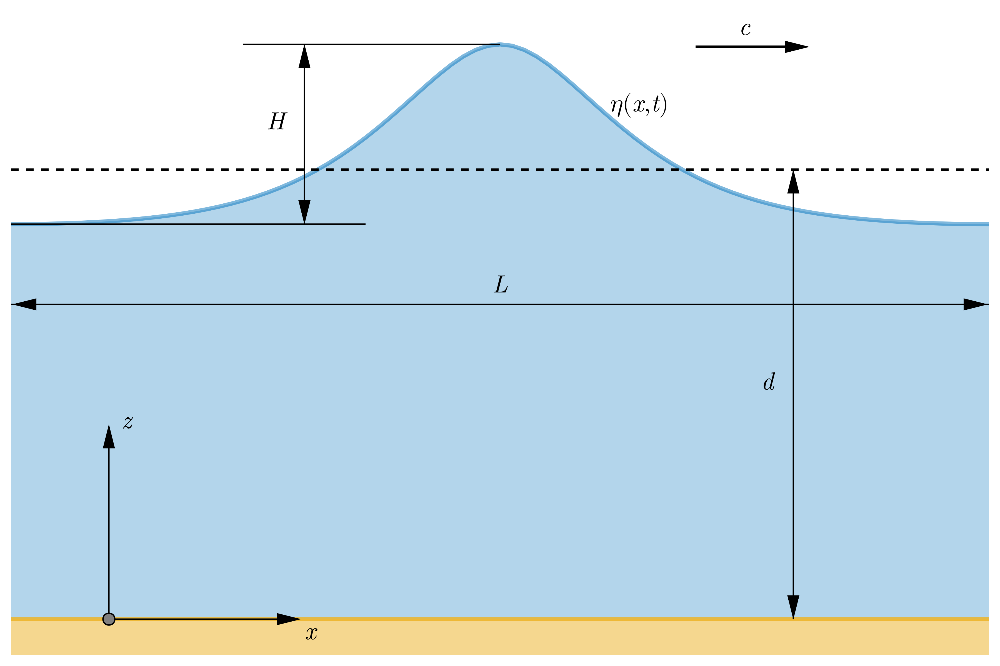

```@meta
CurrentModule = SteadyWaves
```

# SteadyWaves.jl

A [Rienecker1981](@citet) Fourier Approximation Method to steady, periodic, nonlinear waves propagating in water of constant depth.


## Overview

`SteadyWaves.jl` is a Julia package for calculation of properties of steady, periodic, and nonlinear waves within the framework of potential flow. The solution is derived using a Fourier Approximation Method applied to a periodic boundary value problem of waves propagating in water of constant depth [Rienecker1981,Fenton1988,Fenton1999](@cite) up to a limiting height [Williams1981](@cite) with additional capability to describe nonlinear shoaling waves [Rienecker1981](@cite). Unlike [Fenton's implementation](https://johndfenton.com/Steady-waves/Fourier.html) of the method in C and [Roenby's](https://github.com/roenby/fentonWave/blob/master/tests/fenton.m) Matlab script, here, we use [`NonlinearSolve.jl`](https://github.com/SciML/NonlinearSolve.jl) package [Pal2024](@cite) to `solve` a set of nonlinear equations using `RobustMultiNewton` mode.

## Wave problem

We consider steady, periodic waves propagating in water of constant depth. The waves of height $H$ and length $L$ travel at celerity c. The bottom is horizontal, rigid and impervious. The fluid mass is oscillating under restoring force of gravity defined by the acceleration $g$. A schematic view of the plane wave problem is presented in figure 1.


Figure 1. Sketch of a fluid domain with coordinate system definition; the wave of height $H$, length $L$, and profile $\eta(x, t)$ travels in water of mean depth $d$ at celerity $c$.

The basic parameters characterizing regular wave train are listed below:
-  $d$ water depth (m);
-  $H$ wave height (m);
-  $L$ wave length (m);
-  $k$ wave number (rad/s);
-  $c$ wave celerity;
-  $T$ wave period (s);
noting that $c=L/T$.

The wave problem is defined by parameters $d$, $H$, $L$ or $T$, and the mean current $\bar{u}$. There are two possible ways of defining the current criterion. One corresponds to the time-mean Eulerian current $c_E$

$$c - c_E + \bar{u} = 0,$$

while the second to the mean mass-transport velocity $c_S$

$$c - c_S - \frac{Q}{d} = 0,$$

where $Q$ is the volume flux. Please see [Rienecker1981,Fenton1988,Fenton1999](@cite) for more in-depth discussion on current criteria.

In the area occupied by the inviscid and incompressible fluid, the irrotational oscillatory flow is defined by some physical quantities of practical interest such as displacement, velocity and acceleration of fluid elements and pressure:
*  $\eta(x, t)$ free-surface elevation above the bottom (m);
*  $u(x, z, t)$ horizontal velocity component (m/s);
*  $w(x, z, t)$ vertical velocity component (m/s);
*  $p(x, z, t)$ pressure (Pa).
